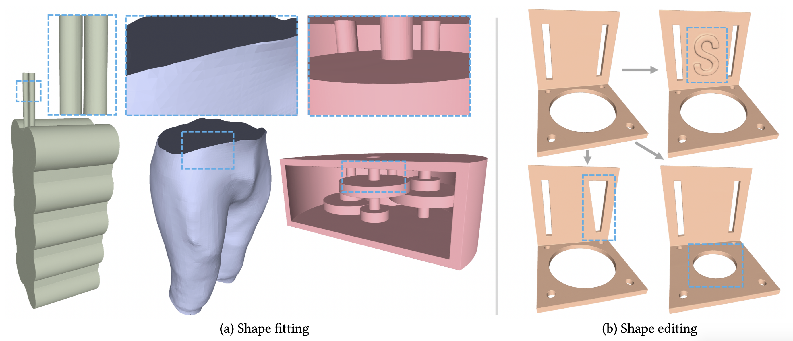

# Patch-Grid

This is the code for paper

[Patch-Grid: An Efficient and Feature-Preserving Neural Implicit Surface Representation](https://arxiv.org/abs/2308.13934) by 

Guying Lin, Lei Yang, Congyi Zhang, Hao Pan, Yuhan Ping, Guodong Wei, Taku Komura, John Keyser, Wenping Wang

## Introduction

We present a unified neural implicit representation, called Patch-Grid, that fits to complex shapes efficiently, preserves sharp features, and effectively models surfaces with open boundaries and thin geometric features. 

Our superior efficiency comes from embedding each surface patch into a local latent volume and decoding it using a shared MLP decoder, which is pretrained on various local surface geometries. With this pretrained decoder fixed, fitting novel shapes and local shape updates can be done efficiently(within 8 seconds and within 1 second, respectively). The faithful preservation of sharp features is enabled by adopting a novel merge grid to perform local constructive solid geometry (CSG) combinations of surface patches in the cells of an adaptive Octree, yielding better robustness than using a global CSG construction as proposed in the literature. 

Experiments show that our Patch-Grid method faithfully captures shapes with complex sharp features, open boundaries and thin structures, and outperforms existing learning-based methods in both efficiency and quality for surface fitting and local shape updates.

