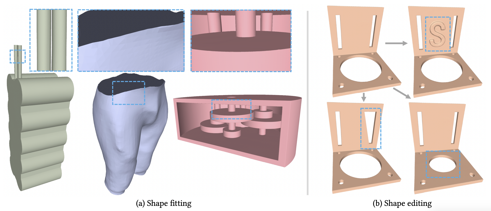

# Patch-Grid (TOG 2025)

---

This repository contains the code accompanying the paper

[Patch-Grid: An Efficient and Feature-Preserving Neural Implicit Surface Representation](https://arxiv.org/abs/2308.13934).

The paper has been accepted and published in **ACM Transactions on Graphics**.

Our test data and results are available at [this link](https://1drv.ms/f/c/a4366e97cdb15c82/EpkFfjvSUJ9IgJfeZzMOEQYBqA6iKpu7pnrS_Hog4fnF-g?e=pJUpTQ). You can download the data for training or obtain the results to view the visual effects.

## Timeline

- [x] Training code and data
- [ ] Preprocess code — ETA: in April

## Introduction

We present a unified neural implicit representation, called Patch-Grid, that fits to complex shapes efficiently, preserves sharp features, and effectively models surfaces with open boundaries and thin geometric features. 

Our superior efficiency comes from embedding each surface patch into a local latent volume and decoding it using a shared MLP decoder, which is pretrained on various local surface geometries. With this pretrained decoder fixed, fitting novel shapes and local shape updates can be done efficiently(within 8 seconds and within 1 second, respectively). The faithful preservation of sharp features is enabled by adopting a novel merge grid to perform local constructive solid geometry (CSG) combinations of surface patches in the cells of an adaptive Octree, yielding better robustness than using a global CSG construction as proposed in the literature. 

Experiments show that our Patch-Grid method faithfully captures shapes with complex sharp features, open boundaries and thin structures, and outperforms existing learning-based methods in both efficiency and quality for surface fitting and local shape updates.



## Environment 

Install and activate the environment with the following command.

```
conda env create -f patchgrid.yaml
conda activate patchgrid
pip install https://download.pytorch.org/whl/cu111/torch-1.10.1%2Bcu111-cp39-cp39-linux_x86_64.whl
pip install https://download.pytorch.org/whl/cu111/torchaudio-0.10.1%2Bcu111-cp39-cp39-linux_x86_64.whl
pip install https://download.pytorch.org/whl/cu111/torchvision-0.11.2%2Bcu111-cp39-cp39-linux_x86_64.whl
```

To compute our metrics, we utilize the CUDA implementation from [NGLOD](https://github.com/nv-tlabs/nglod) to compute the points to surface distance. Please compile the CUDA extension using the following command:

```
cd metrics/lib/extensions
chmod +x build_ext.sh && ./build_ext.sh
```

We test our environment on Ubuntu 20.4, Python 3.9.7, CUDA version 11.7.

## Data 

We have prepared 3 shapes ready to train in the `data/train` folder of [this link](https://1drv.ms/f/c/a4366e97cdb15c82/EpkFfjvSUJ9IgJfeZzMOEQYBqA6iKpu7pnrS_Hog4fnF-g?e=pJUpTQ). You can simply download the files and put them in the `data/train` folder.

## Train

We provide two training schemas of our method, denoted as `Patch-Grid` and `Patch-Grid-TS`, representing training with a fixed and pretrained MLP, or training from scratch, respectively. 

### Patch-Grid

For the training of `Patch-Grid`, we provide the the checkpoints of pretrained MLP ready to use in the folder `shape_space/checkpoints` of [this link](https://1drv.ms/f/c/a4366e97cdb15c82/EpkFfjvSUJ9IgJfeZzMOEQYBqA6iKpu7pnrS_Hog4fnF-g?e=pJUpTQ). Please download and put them in the folder of `_results/shape_space`.

To train the model, please run the following command: 
```
python train.py --dataset_path data/train/[name_for_shape] --exp_name [name_for_exp] --pretrained [path_for_checkpoint] --fix_decoder --use_shape_space

e.g.
python train.py --dataset_path data/train/00000006_0 --exp_name 00000006_0 --pretrained _results/shape_space/decoder_1.pth --fix_decoder --use_shape_space
```

### Patch-Grid-TS

For the training of `Patch-Grid-TS`, we train from scratch. Please run the following command:
```
python train.py --dataset_path data/train/[name_for_shape] --exp_name [name_for_exp] --epochs 500 --mile_stone 470 485

e.g.
python train.py --dataset_path data/train/00000006_0 --exp_name 00000006_0 --epochs 500 --mile_stone 470 485
```

## Extract

We use marching cube to extract the geometry. Please run the following command:

```
python extract.py --pretrained [path_for_checkpoint] --mesh_path_prefix [path_for_saved_mesh] --exp_name [name_for_exp] --dataset_path [path_for_dataset]

e.g.
python extract.py --pretrained _results/models/00000006_0.pth --mesh_path_prefix _results/mesh --exp_name 00000006_0 --dataset_path data/train/00000006_0
```

## Metrics

For the evaluation of the mesh-based metrics, including 1) symmetric Chamfer distance; 2) the Hausdorff distance; 3) the F-score based on CD; 4) the Intersection over Union; and 5) the normal consistency. Please run the command:
```
python metrics/mesh_metrics.py --gt_path [path_to_gt_mesh] --recon_path [path_to_recon_mesh] --metrics_file [path_to_metrics_file] 

e.g.
python metrics/mesh_metrics.py --gt_path data/train/00000006_0/00000006_0.obj --recon_path _results/mesh/00000006_0_composed_all.obj --metrics_file metrics.txt
```

For the evaluation of the field-based metrics, including 1) field error; and 2) the sharp feature error, please run the command:
```
python metrics/field_metrics.py --local_path [path_for_checkpoint] --dataset_path [path_for_shape_data] --field_metrics_file [path_to_metrics_file]

e.g. 
python metrics/field_metrics.py --local_path _results/models/00000006_0.pth --dataset_path data/train/00000006_0 --field_metrics_file metrics_field.txt
```

## Shape updating

We provide our results in the `results/update_results` folder of [this link](https://1drv.ms/f/c/a4366e97cdb15c82/EpkFfjvSUJ9IgJfeZzMOEQYBqA6iKpu7pnrS_Hog4fnF-g?e=pJUpTQ).

### Preprocess 

We prepare test data in the `data/edit` folder of [this link](https://1drv.ms/f/c/a4366e97cdb15c82/EpkFfjvSUJ9IgJfeZzMOEQYBqA6iKpu7pnrS_Hog4fnF-g?e=pJUpTQ). Please download the files and put them in the folder `data/edit`.

### Train

Please firstly train the original shape.
```
python train.py --dataset_path data/edit/243_ori --exp_name 243_ori --pretrained _results/shape_space/decoder_2.pth --fix_decoder --use_shape_space --num_layers 2
```

Then, please run:

```
python train.py --dataset_path [path_to_data] --follow_shape_name [original_shape_name] --exp_name [name_for_exp] --pretrained [path_to_original_checkpoint] --fix_decoder --update --num_layers 2 --epochs 80 --mile_stone 65 72 --save-every 20

e.g.
python train.py --dataset_path data/edit/243_round --follow_shape_name 243_ori --exp_name 243_round_update --pretrained _results/models/243_ori.pth --fix_decoder --update --num_layers 2 --epochs 80 --mile_stone 65 72 --save-every 20

```

### Extract

For extraction, please run:

```
python extract.py --pretrained [path_to_checkpoint] --mesh_path_prefix [path_prefix_for_mesh] --exp_name [name_for_exp] --dataset_path [path_to_data] --num_layers 2

e.g.
python extract.py --pretrained _results/models/243_round_update.pth --mesh_path_prefix _results/mesh --exp_name 243_round_update --dataset_path data/edit/243_round --num_layers 2

```

## Citation

```bibtex
@article{lin2025patchgrid,
  author  = {Lin, Guying and Yang, Lei and Zhang, Congyi and Pan, Hao and Ping, Yuhan and Wei, Guodong and Komura, Taku and Keyser, John and Wang, Wenping},
  title   = {Patch-Grid: An Efficient and Feature-Preserving Neural Implicit Surface Representation},
  journal = {ACM Transactions on Graphics},
  volume  = {44},
  number  = {2},
  year    = {2025},
  month   = apr,
  articleno = {16},
  doi     = {10.1145/3727142},
  url     = {https://doi.org/10.1145/3727142},
}
```
